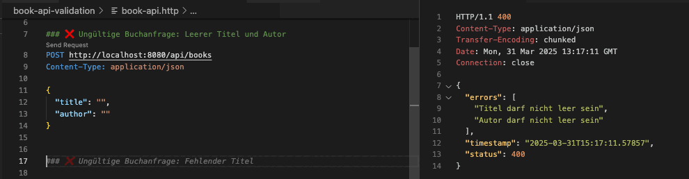
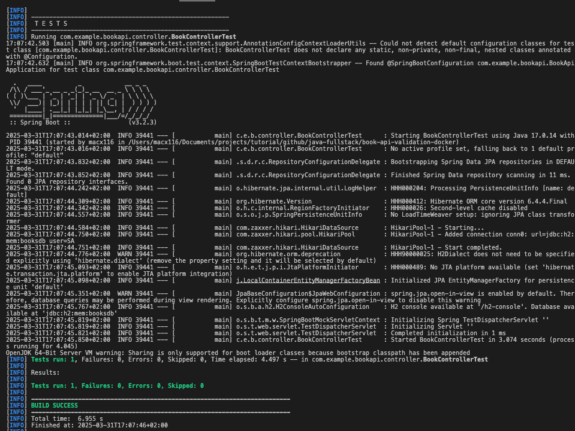
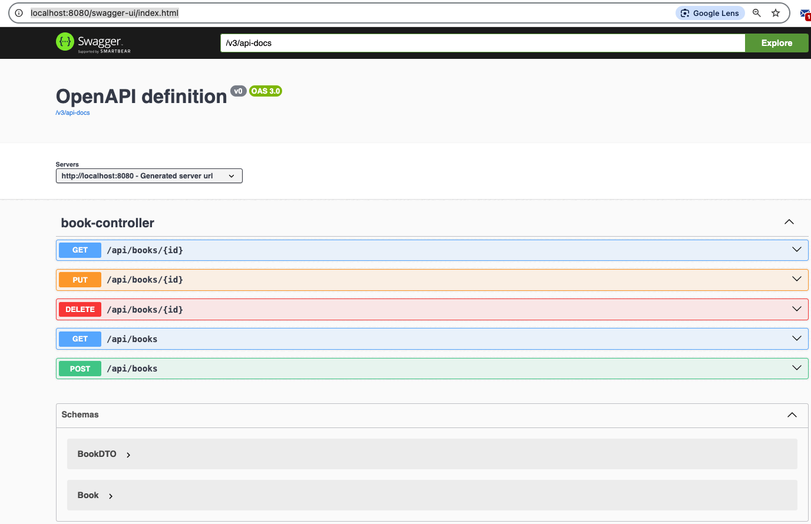
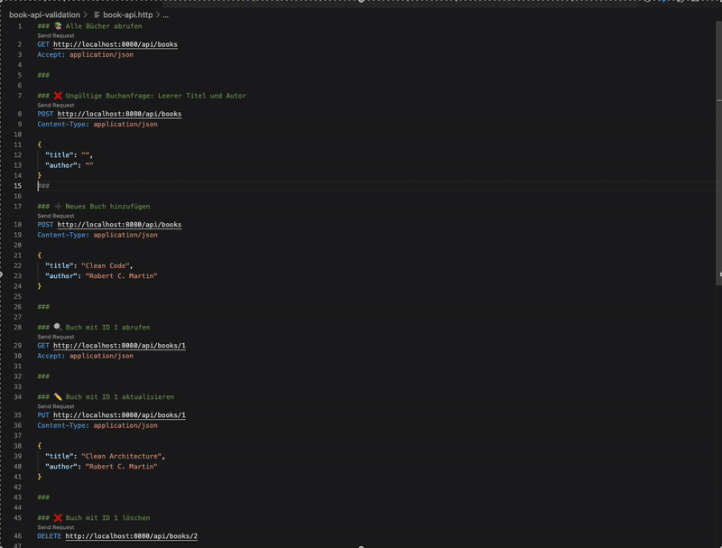

# 📚 Book API Validation – Docker Edition

Dieses Projekt zeigt eine vollständige Spring Boot REST API mit DTO-Validierung, globalem Fehler-Handling, MockMvc-Tests und Docker-Deployment.

## 🚀 Features

- `POST /api/books` – Buch mit Validierung anlegen
- `GET /api/books` – Liste aller Bücher
- DTO mit `@NotBlank`-Validierung
- Fehlerbehandlung mit `@ControllerAdvice`
- JUnit 5 + MockMvc Integrationstests
- H2-Datenbank (in-memory)
- Swagger UI automatisch aktiv
- Dockerfile zum Containerisieren

## ▶️ Projekt starten

```bash
mvn clean package ## Hier starte mockmvc unittest

```

## 🐳 Docker verwenden

```bash
docker-compose down
docker-compose up --build

```

## 🧪 Testübersicht

### 🛡️ Eingabevalidierung & Fehlerbehandlung (HTTP 400)



### 🧪 Automatisierte REST-Tests mit JUnit 5 & MockMvc



### 📘 Interaktive API-Dokumentation mit Swagger UI



### 📄 API-Tests mit .http-Dateien direkt in VS Code



## 🧑‍💻 Autor

Thanh – Java Fullstack Developer
