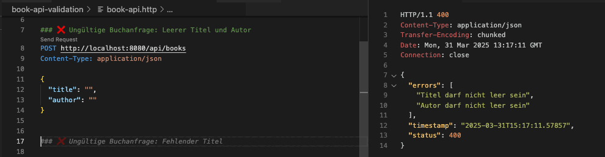
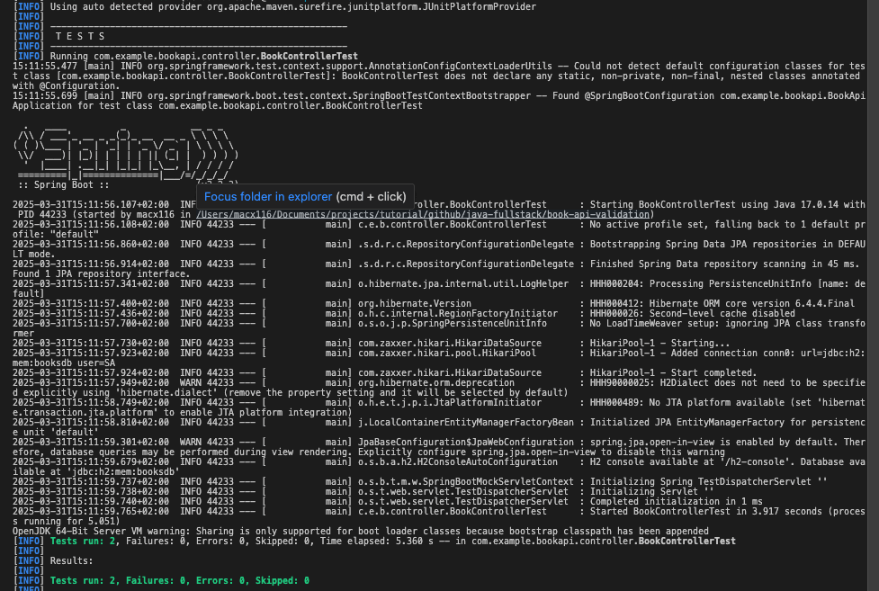
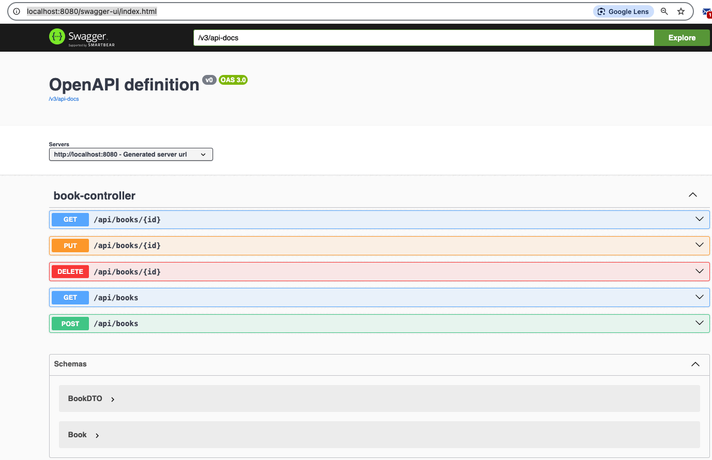
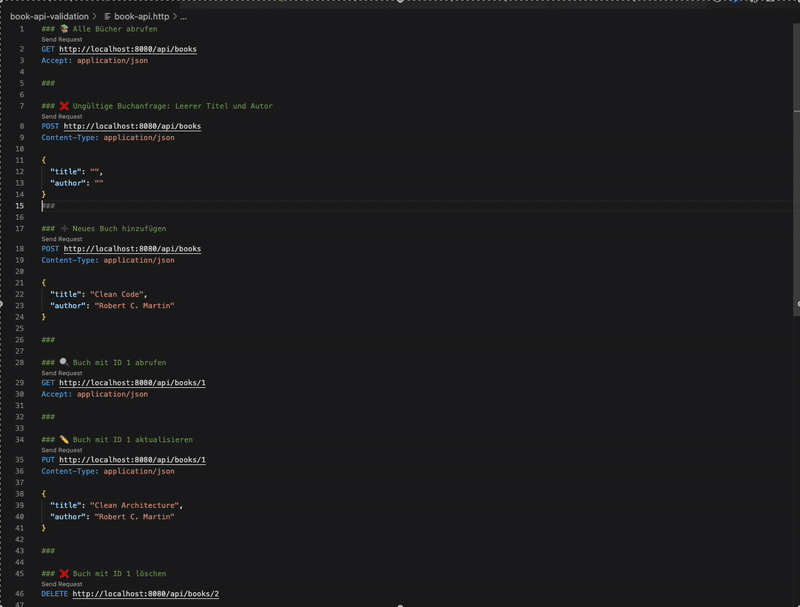

# 📚 Book API – Spring Boot + DTO + Validation + JUnit + Swagger

Dies ist Teil meines Java Fullstack Demo-Projekts.  
Es zeigt, wie man eine saubere REST-API mit folgenden Technologien aufbaut:

- 📦 Spring Boot + Spring Data JPA
- 🗃️ H2 In-Memory-Datenbank
- 🧾 DTOs + Validierung mit `@Valid`
- 🧪 Unit-Tests mit JUnit 5 & MockMvc
- 📘 API-Dokumentation mit Swagger/OpenAPI

---

## 🚀 Features

- 📖 Buch anlegen (`POST /api/books`)
- 📚 Alle Bücher abrufen (`GET /api/books`)
- 🔍 Buch nach ID anzeigen (`GET /api/books/{id}`)
- ✏️ Buch aktualisieren (`PUT /api/books/{id}`)
- ❌ Buch löschen (`DELETE /api/books/{id}`)
- ✅ Eingabevalidierung mit Annotationen (`@NotBlank`, `@Valid`)
- 🧪 Unit-Tests mit `MockMvc`
- 📘 Dokumentation mit Swagger/OpenAPI

---

## 🧪 Testübersicht

### 🛡️ Eingabevalidierung & Fehlerbehandlung (HTTP 400)

### 🧪 Automatisierte REST-Tests mit JUnit 5 & MockMvc

### 📘 Interaktive API-Dokumentation mit Swagger UI

### 📄 API-Tests mit .http-Dateien direkt in VS Code

